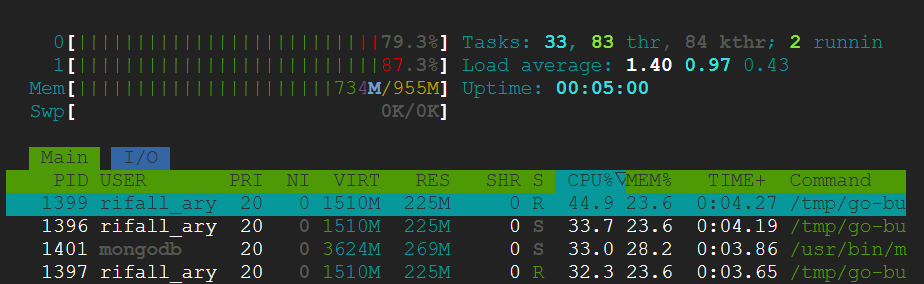
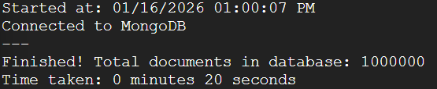

# Information
- MongoDB version: v8.0.17
- Go version: go1.24.4

I chose Go because I like the `goroutine` and how simple yet powerful the syntax is. This is my second favorite programming language.

```
// install go 
sudo apt-get update
sudo apt-get install -y golang-go
go version

// install mongodb
sudo apt-get install -y gnupg
curl -fsSL https://www.mongodb.org/static/pgp/server-8.0.asc | \
   sudo gpg -o /usr/share/keyrings/mongodb-server-8.0.gpg --dearmor
echo "deb [ arch=amd64,arm64 signed-by=/usr/share/keyrings/mongodb-server-8.0.gpg ] https://repo.mongodb.org/apt/ubuntu jammy/mongodb-org/8.0 multiverse" | sudo tee /etc/apt/sources.list.d/mongodb-org-8.0.list
sudo apt-get update
sudo apt-get install -y mongodb-org
sudo systemctl start mongod
sudo systemctl enable mongod
mongod --version
```

# Setup

Extract the dataset:
```
unzip yelp_database.csv.zip
```

# Implementation Approaches

Each test was performed in a clean state (VM rebooted) with a cleared database. The initial state had ~300MB of RAM usage.

## main.go
I rewrote mainV3.js in Go, using a buffered channel with a capacity of 10 and goroutines to handle batch insertion.

### Result



The result is faster than the NodeJS version. With increasing RAM usage by ~100MB, this version has less processing time, which is 20 seconds (reduced by 34 seconds). This is because goroutine is more efficient than event loop in NodeJS. But why only use 10 goroutines instead of 100 or 1000 goroutines? Because more goroutines to run means more memory to use. Since this machine only has 1GB RAM, it will make the program run out of memory (signal: killed).