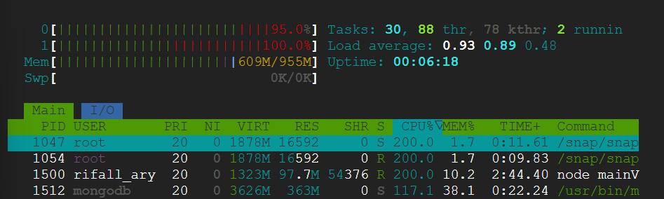
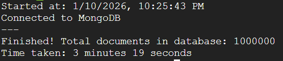
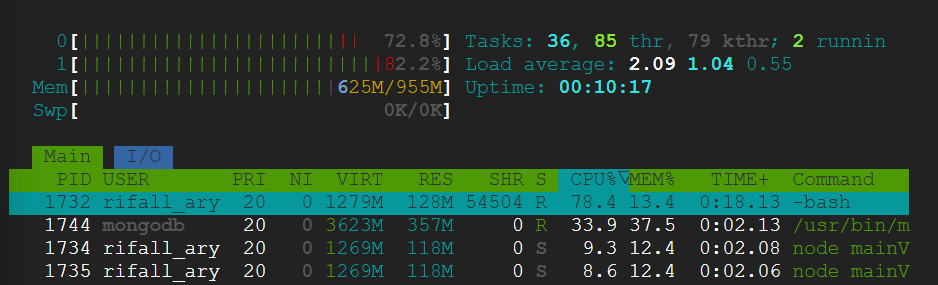
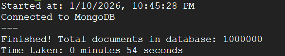

# Information
MongoDB version: v8.0.17
NodeJS version: v22.21.0

I chose NodeJS because it's the programming language I'm most comfortable with.

```
// install nodejs 
sudo apt-get update
sudo apt-get install -y curl
curl -fsSL https://deb.nodesource.com/setup_22.x | sudo -E bash -
sudo apt-get install -y nodejs
node -v

// install mongodb
sudo apt-get install -y gnupg
curl -fsSL https://www.mongodb.org/static/pgp/server-8.0.asc | \
   sudo gpg -o /usr/share/keyrings/mongodb-server-8.0.gpg --dearmor
echo "deb [ arch=amd64,arm64 signed-by=/usr/share/keyrings/mongodb-server-8.0.gpg ] https://repo.mongodb.org/apt/ubuntu jammy/mongodb-org/8.0 multiverse" | sudo tee /etc/apt/sources.list.d/mongodb-org-8.0.list
sudo apt-get update
sudo apt-get install -y mongodb-org
sudo systemctl start mongod
sudo systemctl enable mongod
mongod --version
```

# Setup

Extract the dataset:
```
unzip yelp_database.csv.zip
```

# Implementation Approaches

Each test was performed in a clean state (VM rebooted) with a cleared database. The initial state had ~300MB of RAM usage.

## main.js
Loads the entire file into memory and inserts rows one-by-one.

### Result
After 2 minutes, the VM ran out of memory:
```
Started at: 1/10/2026, 9:04:20 PM
---
Connected to MongoDB

<--- Last few GCs --->
nt[2970:0x1ae64000]    20097 ms: Mark-Compact (reduce) 476.9 (486.1) -> 476.1 (486.3) MB, pooled: 0 MB, 442.22 / 0.00 ms  (+ 19.6 ms in 0 steps since start of marking, biggest step 0.0 ms, walltime since start of marking 474 ms) (average mu = 0.448, current[2970:0x1ae64000]    20930 ms: Mark-Compact (reduce) 477.0 (486.3) -> 476.6 (486.8) MB, pooled: 0 MB, 388.25 / 0.00 ms  (+ 66.3 ms in 0 steps since start of marking, biggest step 0.0 ms, walltime since start of marking 478 ms) (average mu = 0.451, current

<--- JS stacktrace --->

FATAL ERROR: Reached heap limit Allocation failed - JavaScript heap out of memory
```

This approach is inefficient for large datasets because it tries to hold all records in memory simultaneously.

## mainV2.js
Uses streaming approach with batch processing of 1,000 records per batch.

### Result




This approach successfully imports the data without memory issues.

## mainV3.js
Optimized batch processing with 10,000 records per batch (1% of total data).

The batch size is calculated based on the data structure:
```
{
    ID: '5',
    Time_GMT: '3/12/2021 2:10',
    Phone: '12562155510',
    Organization: "Arby's",
    OLF: '',
    Rating: '2',
    NumberReview: '7',
    Category: 'Delivery',
    Country: 'USA',
    CountryCode: 'US',
    State: 'AL',
    City: 'Alexander City',
    Street: ' 2593 Hwy',
    Building: '2593'
  }
```

Each record is approximately 200-345 bytes. With 10,000 records per batch:
```
10,000 × 345 = 3,450,000 bytes ≈ 3.45 MB per batch
```

Total batches needed:
```
1,000,000 / 10,000 = 100 batches
```

Estimated total memory usage:
```
100 × 3.45 = 345 MB
```

This fits comfortably within the 1GB RAM limit.

### Result




This approach is faster than mainV2.js while maintaining similar memory usage.